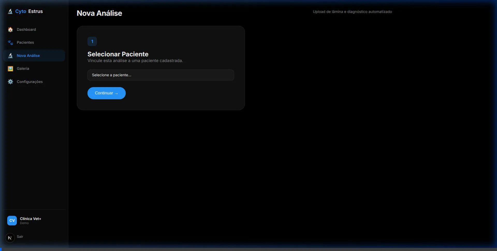
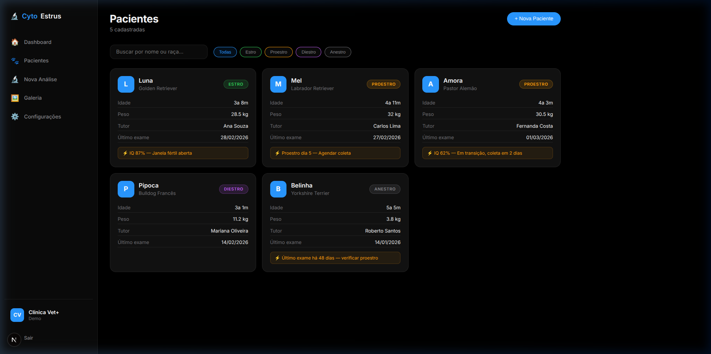
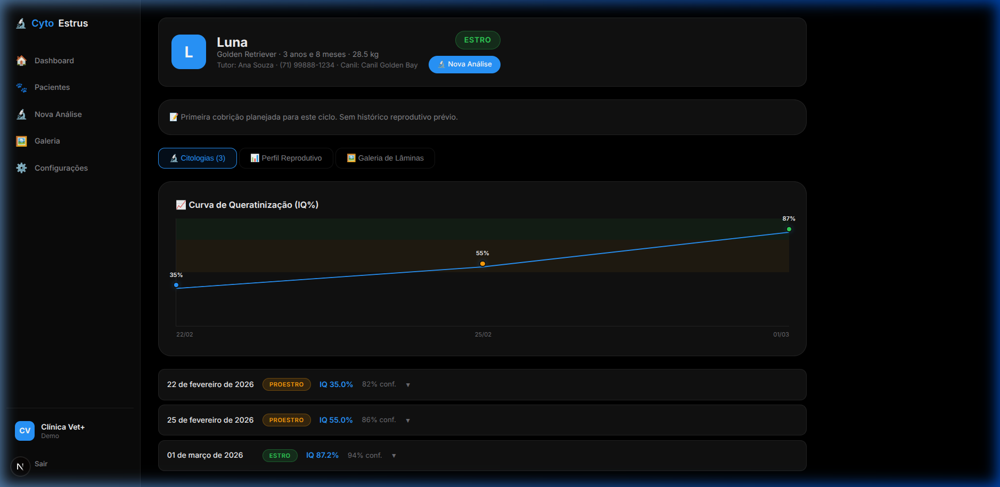
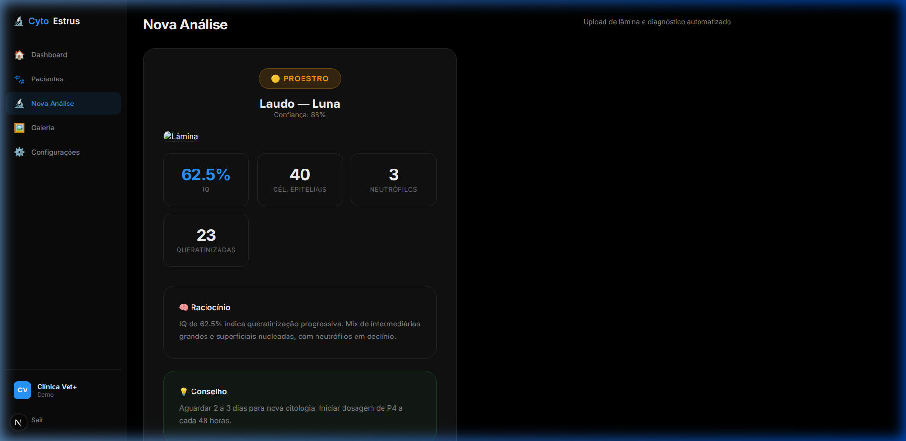
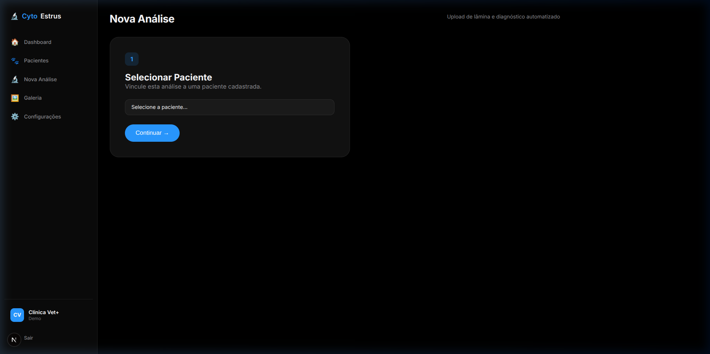
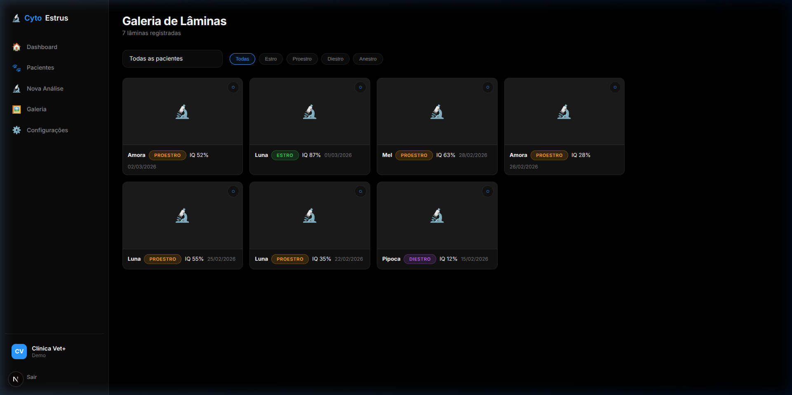
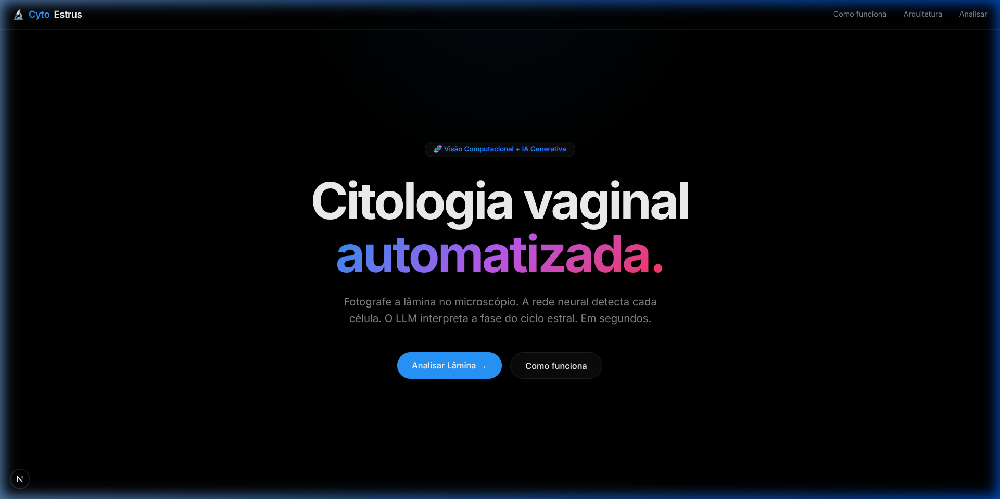

<p align="center">
  <h1 align="center">🔬 CytoEstrus v2</h1>
  <p align="center">
    <strong>Citologia vaginal canina automatizada com IA</strong>
  </p>
  <p align="center">
    
    
    
    
    
    
    
  </p>
  <p align="center">
    Fotografe a lâmina no microscópio. A rede neural detecta cada célula.<br>
    O LLM interpreta a fase do ciclo estral. Em segundos.
  </p>
  <p align="center">
    <a href="#problema">O Problema</a> •
    <a href="#solucao">A Solução</a> •
    <a href="#screenshots">Screenshots</a> •
    <a href="#features">Features</a> •
    <a href="#como-usar">Como usar</a> •
    <a href="#comercial">Proposta Comercial</a>
  </p>
</p>

---

## <a name="problema"></a>💡 O Problema

A citologia vaginal é o exame mais custo-efetivo para determinar a fase do ciclo estral na cadela — essencial para maximizar taxas de concepção em programas reprodutivos. Porém:

- A **concordância entre veterinários** lendo o mesmo esfregaço é de apenas **κ = 0.412** (Reckers et al. 2022 — *Frontiers in Veterinary Science*)
- A leitura manual é **lenta, subjetiva e altamente dependente de experiência específica**
- **Não existia** até hoje um pipeline aberto de visão computacional para citologia vaginal **canina**
- Veterinários de campo perdem **até 30% dos ciclos férteis** por falhas no timing de inseminação

---

## <a name="solucao"></a>🚀 A Solução

O **CytoEstrus v2** é o primeiro sistema open-source que automatiza a leitura de citologia vaginal canina usando uma arquitetura híbrida de **Computer Vision + LLM**:

- Fotografe a lâmina com o celular adaptado à ocular
- A rede neural **YOLOv8-nano** detecta e classifica 6 tipos celulares em tempo real
- O **LLM** (Gemini Pro / Claude) recebe apenas o JSON de contagens (~200 tokens) e interpreta:
  - Fase do ciclo (**Estro, Proestro, Diestro, Anestro**)
  - Índice de Queratinização (IQ) calculado automaticamente
  - **Janela de fertilidade** com previsão baseada em Concannon (2011) e Johnston et al. (2001)
  - Conselho reprodutivo com timing de inseminação

---

## <a name="screenshots"></a>📸 Screenshots

### 🎬 Análise ao Vivo (Demo MVP)


### Plataforma Core


### Gestão de Pacientes



### Nova Análise Direto do Perfil


### Nova Análise e Upload


### Galeria de Citologias


### Landing Page & Login



---

## <a name="features"></a>✨ Features

### Análise Inteligente 🔬
- **Detecção celular YOLOv8** — 6 classes: parabasais, intermediárias (S/L), superficiais nucleadas, escamas anucleares, neutrófilos
- **Índice de Queratinização automático** — IQ ≥ 80% = Estro confirmado
- **Célula de metestro** — Detectada por sobreposição espacial (neutrófilo dentro de intermediária)

### Predição de Fertilidade 📅
- **Janela fértil visual** — Timeline interativa mostrando posição atual no ciclo
- **Estimativa de ovulação** — Baseada em IQ + fase (Concannon 2011)
- **Timing de IA** — Recomendação de dias para inseminação artificial
- **Base científica** — Cada predição referencia literatura peer-reviewed

### Interface Premium 🎨
- **Design Apple-inspired** — Dark mode puro, tipografia Inter, glassmorphism
- **Drag & drop** — Upload por arrasto ou clique
- **Análise animada** — Pipeline visual de 4 etapas com feedback em tempo real
- **Laudo exportável** — JSON completo para integração com prontuários

### Pipeline ML (Python) 🧠
- **Web scraper** — Coleta automatizada de imagens de literatura científica aberta
- **AI Annotation** — Anotação assistida via Gemini Pro Vision
- **Data augmentation** — Pipeline Albumentations (15x por imagem)
- **Two-stage inference** — YOLOv8 → JSON → LLM → Laudo clínico

---

## 🏗 Arquitetura

```
IMAGEM DA LÂMINA ──► YOLOv8-nano ──► JSON de Contagens ──► LLM (Gemini/Claude)
    (foto celular)     detecta e         parabasais: 2         interpreta fase
                       classifica 6      superficiais: 38      IQ: 87.4%
                       tipos celulares   anucleares: 19        Fase: ESTRO ✅
                                         neutrófilos: 0        IA: Hoje ou amanhã
```

| Módulo | Vantagem | Custo |
|--------|----------|-------|
| **YOLOv8-nano** | Rápido, determinístico, roda offline | $0 / inferência |
| **LLM** | Recebe só JSON (~200 tokens), raciocínio clínico | ~$0.002 / lâmina |

---

## <a name="como-usar"></a>🏁 Como Usar

### Web App

```bash
cd web-app
npm install
npm run dev
```

Abra [http://localhost:3000](http://localhost:3000) no navegador.

### Pipeline ML (Python)

```bash
pip install -r requirements.txt

# 1. Coletar imagens de literatura científica
python scripts/00_scrape_internet_dataset.py

# 2. Anotar com Gemini Pro Vision
export GOOGLE_API_KEY=seu_token
python scripts/02_annotation_assistant.py

# 3. Augmentação (15x por imagem)
python scripts/03_augment_dataset.py

# 4. Treinar YOLOv8
python scripts/04_train_yolov8.py --epochs 100

# 5. Inferência completa
python scripts/05_inference_pipeline.py --image data/raw/sua_lamina.jpg
```

---

## 📂 Estrutura do Projeto

```
cytoestrus-v2/
├── web-app/                         # Aplicação web (Next.js 16)
│   ├── app/
│   │   ├── page.tsx                 # App interativo (upload → análise → resultado)
│   │   ├── globals.css              # Design system Apple-inspired
│   │   └── layout.tsx               # Root layout + SEO
│   └── package.json
├── scripts/                         # Pipeline ML (Python)
│   ├── 00_scrape_internet_dataset.py
│   ├── 01_fetch_sipakmed.py
│   ├── 02_annotation_assistant.py
│   ├── 03_augment_dataset.py
│   ├── 04_train_yolov8.py
│   └── 05_inference_pipeline.py
├── data/
│   ├── raw/                         # Imagens originais
│   └── annotated/                   # Imagens + labels YOLO
├── docs/
│   ├── morphology_guide.md          # Guia de 6 classes celulares
│   └── screenshots/                 # Screenshots do app
├── dataset.yaml                     # Config YOLOv8
└── requirements.txt
```

---

## 🛠️ Tech Stack

| Camada | Tecnologia |
|--------|-----------|
| **Web App** | Next.js 16 (App Router) + React 19 + TypeScript |
| **Estilo** | Vanilla CSS (dark mode, glassmorphism) |
| **Detection** | YOLOv8-nano (Ultralytics) |
| **Annotation** | Google Gemini Pro Vision |
| **Interpretation** | Gemini Pro / Claude 3.5 Sonnet |
| **Augmentation** | Albumentations + OpenCV |
| **Deep Learning** | PyTorch |

---

## <a name="comercial"></a>💼 Proposta Comercial

### O Mercado

O mercado global de reprodução assistida em pequenos animais está projetado para atingir **US$ 1.8 bilhão até 2028** (Grand View Research). No Brasil, estima-se que existam **70.000 canis registrados** e mais de **180.000 veterinários ativos**, dos quais aproximadamente 15% atuam em reprodução ou clínica de pequenos com demanda reprodutiva.

### O Custo da Subjetividade

Um ciclo estral perdido por falha no timing de inseminação custa, em média:

| Item | Custo |
|------|-------|
| Sêmen congelado perdido | R$ 800 – R$ 15.000 (importado) |
| Nova coleta + envio | R$ 1.200 – R$ 3.000 |
| Tempo de espera (próximo ciclo) | 6 meses |
| Custo oportunidade/genético | Incalculável |

**Com o CytoEstrus, o custo por análise é de R$ 0,05** (API do LLM). A precisão é reprodutível, instantânea e não depende de experiência do operador.

### Modelo de Receita

| Tier | Preço | Inclui |
|------|-------|--------|
| **Starter** | Gratuito | 10 análises/mês, modelo base |
| **Pro** | R$ 99/mês | Ilimitadas, API acesso, laudo PDF, dashboard |
| **Clínica** | R$ 299/mês | Multi-usuário, histórico, integração prontuário |
| **Enterprise** | Sob consulta | On-premise, SLA, modelo customizado |

### Diferencial Competitivo

| CytoEstrus | Concorrência (manual) |
|-----------|----------------------|
| ⚡ 8 segundos | ⏱ 5-15 minutos |
| 🎯 Reprodutível (determinístico) | 😐 κ = 0.412 entre operadores |
| 📱 Foto de celular | 🔬 Câmera científica |
| 💰 R$ 0,05 / análise | 💰 R$ 50-80 / consulta |
| 📊 JSON exportável | 📝 Laudo manuscrito |
| 📅 Predição de janela fértil | ❌ Subjetivo |

### TAM / SAM / SOM

| Métrica | Valor |
|---------|-------|
| **TAM** (veterinários c/ microscópio, global) | US$ 180M |
| **SAM** (Brasil, clínicas de reprodução + canis) | US$ 12M |
| **SOM** (ano 1, MVP) | US$ 200K (2.000 assinantes Pro) |

---

## 📚 Referências Científicas

1. **Reckers et al. (2022).** "Canine Vaginal Cytology: A Revised Definition of Exfoliated Vaginal Cells." *Frontiers in Veterinary Science.* DOI: 10.3389/fvets.2022.834031
2. **Concannon PW (2011).** "Reproductive Cycles of the Domestic Bitch." *Animal Reproduction Science.*
3. **Johnston SD, Root Kustritz MV, Olson PNS (2001).** *Canine and Feline Theriogenology.* Saunders.
4. **UAM-Xochimilco (2020).** "Automatic Estrus Cycle Identification System on Female Dogs Based on Deep Learning." DOI: 10.1007/978-3-030-49076-8_25
5. **Zoetis VETSCAN IMAGYST** — Validação industrial de CNNs para citologia veterinária.

---

## 🗺️ Roadmap

- [x] Pipeline de coleta e anotação automatizada de dataset
- [x] 6 classes celulares com guia morfológico
- [x] Data augmentation (Albumentations 15x)
- [x] YOLOv8 training pipeline
- [x] Two-stage inference (YOLOv8 → LLM)
- [x] Web app premium (Next.js 16 + React 19)
- [x] Janela de predição de fertilidade
- [ ] Treinamento com dataset expandido (>500 imagens)
- [ ] Integração com dosagem de progesterona (P4)
- [ ] API REST pública
- [ ] App mobile (React Native)
- [ ] Laudo em PDF com bounding boxes
- [ ] Dashboard veterinário com histórico por paciente

---

## 🏢 Sobre

**CytoEstrus** é um produto da [Codexor](https://github.com/mateusmmrs) — startup de soluções tech para veterinária construídas com agentes de IA.

---

<p align="center">
  Feito com 🐾 por <strong>Mateus Martins</strong> — Médico Veterinário · Analista de Dados
</p>
